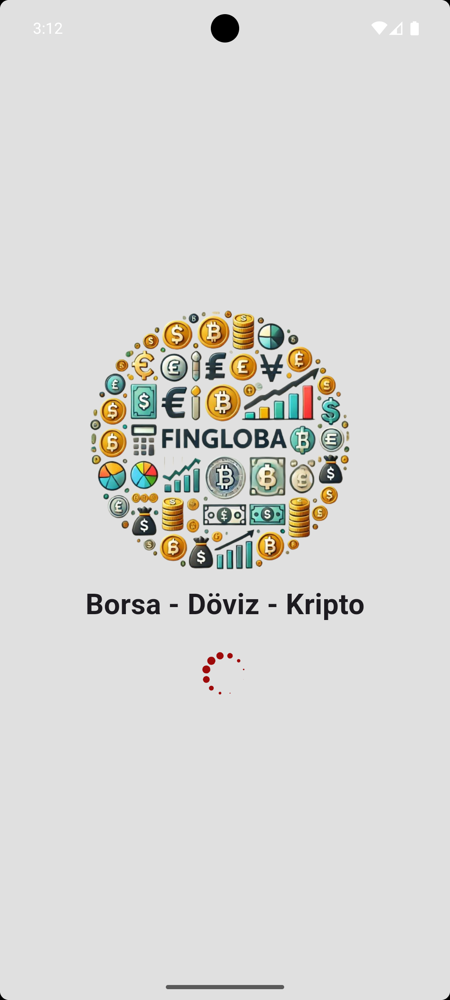
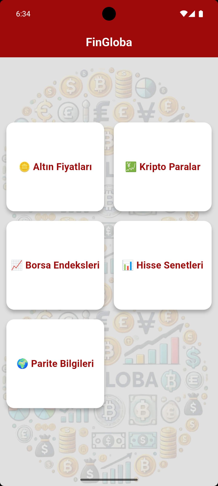
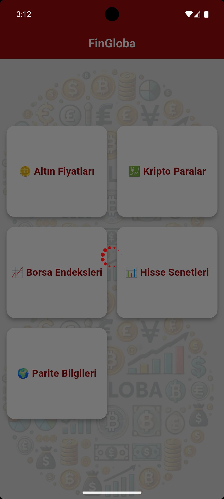
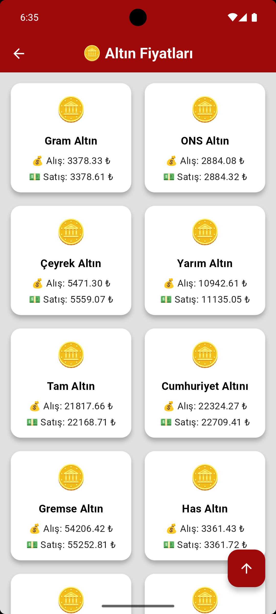
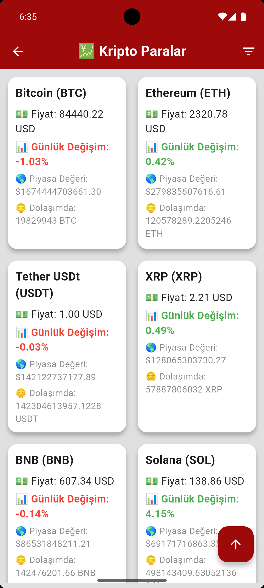
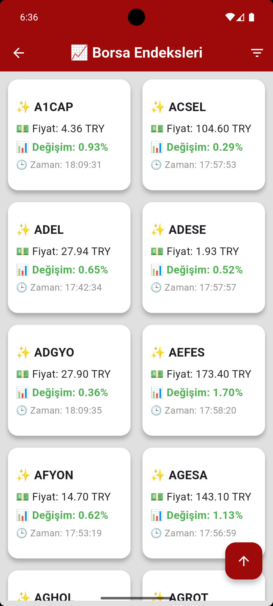
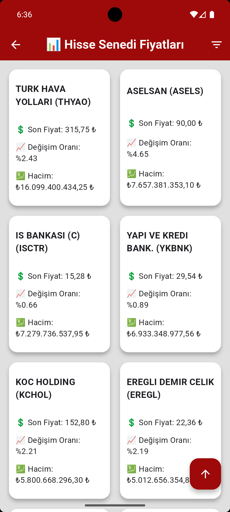
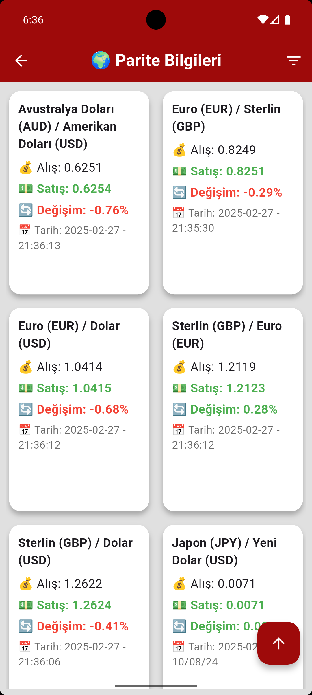

# FinGloba - Finans Dünyasına Açılan Kapınız! 🚀💰

FinGloba, hisse senetlerinden döviz kurlarına, altın fiyatlarından kripto paralara kadar anlık finans verilerini takip edebileceğiniz güçlü ve kullanıcı dostu bir mobil uygulamadır.

Güncel piyasa hareketlerini anında takip edebilir, fiyat değişimlerini filtreleyerek analiz edebilir ve yatırım kararlarınızı daha bilinçli bir şekilde alabilirsiniz.

## 📌 FinGloba ile Neler Yapabilirsiniz?

✅ Hisse Senetleri: Anlık borsa verileri, şirket hisse fiyatları ve değişim oranları.

✅ Kripto Paralar: Bitcoin, Ethereum ve diğer popüler kripto paraların güncel fiyatları.

✅ Döviz Kurları: Dolar, Euro ve diğer para birimleri için detaylı parite bilgileri.

✅ Altın ve Değerli Metaller: Gram altın, çeyrek altın ve diğer değerli metallerin fiyatlarını takip edin.

Kullanıcı dostu arayüzü, şık tasarımı ve hızlı API desteğiyle FinGloba,
finans dünyasında size güçlü bir rehber olacak! 📊📈

🚀 Şimdi FinGloba’yı keşfedin ve finans piyasalarının nabzını tutun!

## 🛠️ Kullanılan Paketler

| Paket                   | Sürüm    | Açıklama                                |
|-------------------------|----------|------------------------------------------|
| `flutter_spinkit`     | ^5.2.1  | Yükleme animasyonları 🔄 |
| `http`         | ^1.3.0  | API işlemleri 🌍 |
| `intl`     | ^0.19.0  | Tarih ve sayı formatlama 🗓 |
| `flutter_localizations`    | sdk: flutter | Çoklu dil desteği 🌎 |
| `provider`       | ^6.1.2  | State management ⚡|
| `shared_preferences`       | ^2.5.2  | Yerel Depolama⚡|
| `custom_refresh_indicator`       | ^4.0.1  | Ekran yenileme⚡|

## 📱 Uygulama İçi Görseller 📱

